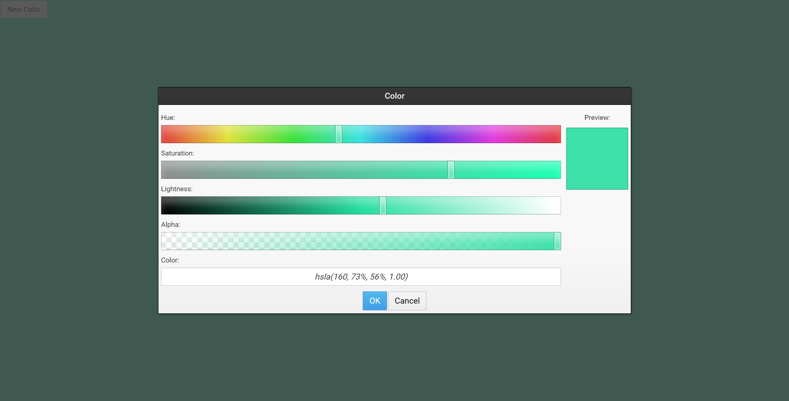

# Tamarack
An easy to use JavaScript library that can create, modify, and style HTML through ECMAScript 6 classes. The backbone of [Socorro Designer](https://github.com/ianmartinez/Socorro-Designer), a user interface designer that outputs content that can be modified dynamically using this library.

Architecture 
-------
Most of Tamarack is a collection of controls that provide a wrapper around html elements, such as tkButton, which wraps around &lt;button&gt; or tkImage, which wraps around &lt;img&gt;. All of these controls inherit from tkControl, which provides them with basic functionality such as making the element full-screen or adding the control to another control. In addition, there are also composite controls, such as tkNotebook and tkDialog, that represent multiple html elements in one single class, cutting down the need for massive amounts of boilerplate code for simple tasks.

Examples
-------
**Add HTML5 video:**
```javascript
var video = new tkVideo();
video.source = "video_source.mp4";
video.addToElement(document.body);
```


**Create a button that makes the video fullscreen when clicked:**
```javascript
var btnFullscreen = new tkButton();
btnFullscreen.text = "Go Fullscreen";				
btnFullscreen.element.onclick = () => video.makeFullScreen();
btnFullscreen.addToElement(document.body);
```

**Create a two page notebook:**
```javascript
var notebook = new tkNotebook();

var page1 = new tkNotebookPage("Page 1", "page1");
page1.addContent(say("Hello"));

var page2 = new tkNotebookPage("Page 2", "page2");
page2.addContent(say("World!"));

notebook.addPages(page1,page2);
notebook.addToElement(document.body);
```


**Show a yes/no dialog:**
```javascript
var dlgMessage = new tkDialog();

dlgMessage.choices = [tkDialogResult.YES, tkDialogResult.NO];
dlgMessage.title = "I was just wondering...";
dlgMessage.addContent(say("Do you like this demo?"));

dlgMessage.show((dialogResult) => {
    if(dialogResult == tkDialogResult.YES)
        alert("Thanks!");
});
```


**Set the background from a color dialog:**
```javascript
var doc = new tkDocument();
var dlgColor = new tkColorDialog();

dlgColor.show((dialogResult) => {
    if (dialogResult == tkDialogResult.OK)
        doc.setBackgroundColor(dlgColor.color.getHslaCss());
});
```


**Initialize a property panel to modify an object: (Coming in a later version)**
```javascript
var prop = new tkPropertyPanel();
var button = new tkButton();

prop.associatedControl = button;

prop.addToElement(document.body);
button.addToElement(document.body);
```
